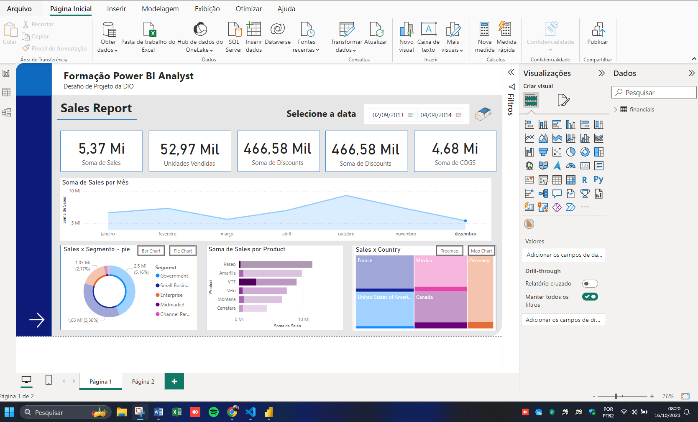
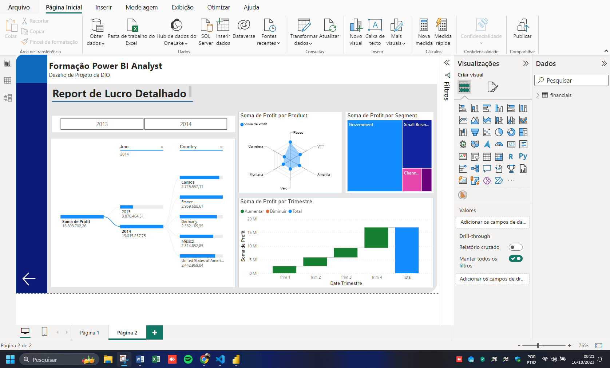

# Power Bi Analytics

Repositório relacionado a formação de Power BI Analyst

### Projeto de Data Analytics com Power BI 

Pontos a serem considerados

[x]	Crie a página detalhes conforme mostrado no desafio de projeto
[x]	Pense na disposição dos visuais em como o cliente irá consumir o conteúdo
    Dependendo da disposição dos visuais o número de páginas pode variar. Até duas páginas podem compor o que é pedido
[x] Crie as medidas necessárias

### Visuais que podem compor o relatório:
[x]	Visuais sobre os TOP3 Produtos
[x] Principais países em termos de vendas e/ou profit (ou outro campo)
[x] Gráfico de dispersão sobre Unidades vendidas e Vendas por mês
[x] Visuais de agrupamentos de dados
[x] Visuais de compartimentação dos dados

# Criando um Relatório de Vendas Elegante com Power BI

@julirmatos @santander @powerbi @digitalinovation @2023

